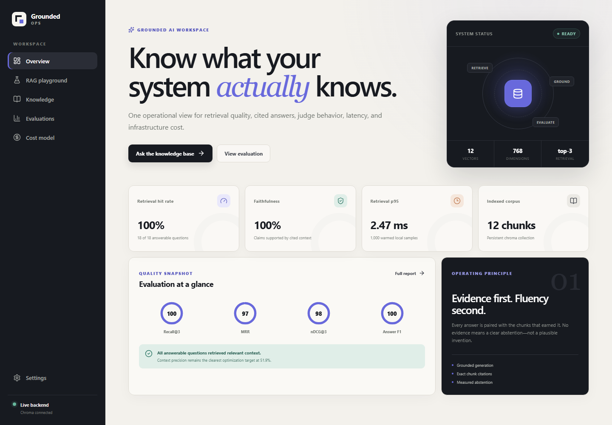
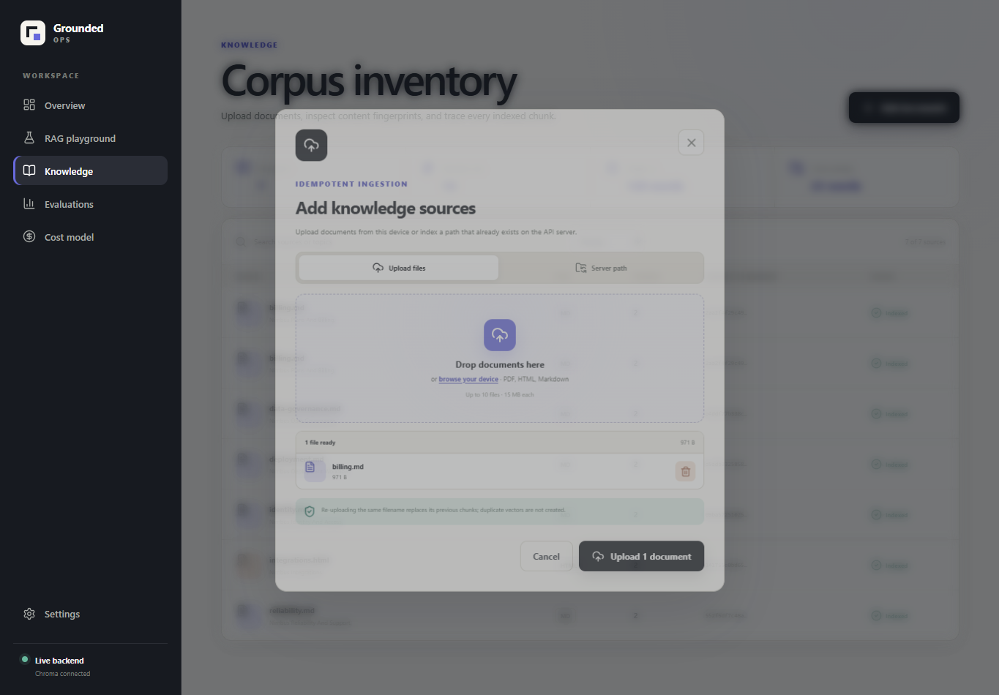

# Applied AI / ML Engineering Take-Home

[](https://github.com/Parthu-M/applied-ai-takehome/actions/workflows/ci.yml)
[](https://render.com/deploy?repo=https://github.com/Parthu-M/applied-ai-takehome)

This repository answers both assignment problems:

1. a Chroma-backed, cost-conscious RAG HTTP service with reproducible retrieval, answer, latency, and cost evaluation; and
2. an auditable pairwise LLM-as-judge pipeline with dual-order judging, a structured rubric, bias probes, human-label validation, and A/B winner declaration.

Everything runs without secrets in deterministic local mode. The RAG service can switch from extractive generation to OpenAI, and the judging pipeline can switch from its clearly labeled CI oracle to a real independently configured OpenAI judge.

## Quick start

Python 3.11 or later is required.

```powershell
python -m venv .venv
.\.venv\Scripts\Activate.ps1
pip install -e ".[dev]"

python -m ai_takehome.rag.cli ingest data/corpus
python -m ai_takehome.rag.cli query "How long are Enterprise audit events retained?"
pytest
```

On macOS/Linux, activate with `source .venv/bin/activate`. All configuration is read from environment variables; `.env.example` documents the available settings. No secret is hardcoded or committed.

Start the HTTP service

```powershell
uvicorn ai_takehome.rag.api:app --host 0.0.0.0 --port 8000
```

Then call it:

```powershell
curl.exe -X POST http://localhost:8000/query `
  -H "Content-Type: application/json" `
  -d '{\"question\":\"Which algorithm signs webhooks?\",\"k\":3,\"metadata_filter\":{\"doc_type\":\"html\"}}'
```

The interactive OpenAPI documentation is at `http://localhost:8000/docs`.

## Frontend

The repository includes **Grounded Ops**, a responsive React/TypeScript operations console for the RAG system. It provides:

- an executive overview with health, quality, latency, and cost signals;
- an interactive RAG playground with filters, citations, evidence inspection, and copy support;
- a searchable corpus inventory with drag-and-drop file upload and advanced path ingestion;
- retrieval, answer-quality, judge, bias, and cost report views; and
- demo/live API modes with a configurable backend URL.



### Frontend development

Node.js 20 or later is required. The development server starts in demo mode, so the complete interface can be explored without a running API:

```powershell
cd frontend
npm ci
npm run dev
```

Open `http://localhost:5173`. To use live data, start FastAPI on port 8000, open **Settings → API connection**, select **Live API**, and use `http://localhost:8000` as the API base URL.

Run the frontend checks with:

```powershell
npm test
npm run build
```

### Integrated production build

The production build is embedded in the Python package and served from the same origin as the API:

```powershell
cd frontend
npm ci
npm run build:embed
cd ..
uvicorn ai_takehome.rag.api:app --host 0.0.0.0 --port 8000
```

Open `http://localhost:8000`. The embedded build defaults to live mode; no CORS configuration is needed because the UI and API share an origin.

### Docker and deployment

Build and run the complete frontend/API image:

```powershell
docker build -t grounded-ops .
docker run -d --name grounded-ops -p 8000:8000 `
  -v grounded-ops-runtime:/app/.runtime grounded-ops
docker exec grounded-ops rag ingest data/corpus
```

The site is then available at `http://localhost:8000`; `/health` is the deployment health-check path.

The root `render.yaml` provides a one-click free Render deployment in the Singapore region. The container idempotently ingests `data/corpus` before starting, so every fresh instance has a usable baseline knowledge base. Free Render web services use an ephemeral filesystem: browser uploads and Chroma changes survive only until the next restart, redeploy, or idle spin-down. For persistent uploads, change the service to a paid `starter` instance, attach a disk at `/app/.runtime`, and retain the existing `CHROMA_PATH` and `UPLOAD_DIR` values.

To publish on a container host (Render, Railway, Fly.io, Azure Web App, or a comparable service):

1. Push this repository to the Git provider used by the host.
2. Create a Docker-based web service from the repository root; the included `Dockerfile` builds both layers.
3. Expose container port `8000` and configure the health check as `/health`.
4. Attach a persistent volume at `/app/.runtime` so the Chroma index and query logs survive releases.
5. Set variables from `.env.example`. At minimum, set `AI_TAKEHOME_HOME=/app` and `CHROMA_PATH=/app/.runtime/chroma`; add `OPENAI_API_KEY` only when using an OpenAI-backed generator or judge.
6. Run `rag ingest data/corpus` once in the deployed container, then verify `/health`, `/documents`, and one query in the playground.

For a separately hosted static frontend, run `npm run build` in `frontend/`, publish `frontend/dist/`, set `VITE_DEFAULT_API_MODE=live` and `VITE_API_BASE_URL` before building, and allow the frontend origin through the backend's `CORS_ALLOWED_ORIGINS`.

## Problem 1 — Cost-efficient RAG

### Why Chroma

Chroma is the primary store because it is embedded and persistent, has no per-vector service bill, supports metadata equality filters, and exposes deterministic ID-based upsert/delete operations. It is a good fit for a small team with an existing application host and a lightly queried corpus. The service uses its persistent HNSW collection with cosine distance.

The accepted trade-off is operational ownership. Chroma here is a single-node deployment without managed replication, automated failover, SLAs, or a control plane. I would not choose it merely to minimize the cloud bill if the team then has to build those capabilities.

Chroma's collection API documents `upsert`, metadata `where` filters, and filtered deletion in the [official collection reference](https://docs.trychroma.com/reference/python/collection).

### Ingestion and idempotency

The Knowledge screen and `POST /upload` accept one or more files directly from the browser. `POST /ingest` and `rag ingest` remain available for server-side files, recursive directories, automation, and mounted Docker volumes:

- Markdown: built-in UTF-8 reader
- HTML: standard-library parser that excludes script/style/noscript content
- PDF: `pypdf` text extraction

Copying a file into `data/corpus` does not mutate the vector index by itself. Use **Knowledge → Sync data/corpus**, `POST /ingest`, or `rag ingest data/corpus` after adding or changing files there. Browser uploads are indexed immediately and the inventory refreshes after the request succeeds.

Uploads use multipart form data, validate extensions, reject empty or malformed PDF payloads, sanitize filenames, and enforce the configurable `MAX_UPLOAD_FILES` and `MAX_UPLOAD_MB` limits. Files are persisted under `UPLOAD_DIR` so uploading the same filename updates the same canonical source. Image-only PDFs return an explicit OCR requirement instead of silently indexing empty content. Advanced path ingestion resolves relative paths from `AI_TAKEHOME_HOME` and rejects paths outside that project root.

The Knowledge inventory provides a confirmed delete action. Deleting a browser-managed upload removes both its stored file and all of its Chroma chunks. Removing a server-path document clears its vectors but preserves the original source file, so a later corpus sync can restore it.

Deletion is available as standard `DELETE /documents/{source_id}` and as `POST /documents/{source_id}/delete` for browser gateways or development proxies that do not forward the DELETE method.

Example direct upload:

```powershell
curl.exe -X POST http://localhost:8000/upload `
  -F "files=@C:\documents\policy.pdf" `
  -F "files=@C:\documents\guide.md"
```



Defaults are 120 words per chunk with 25 words of overlap. Both are environment-configurable. `source_id` is a stable hash of the canonical path; chunk IDs hash source, content, chunk settings, position, and text. Before upserting a source, all old chunks for that stable source ID are deleted. This makes an identical re-ingest count-stable and removes stale chunks when either the file or chunking configuration changes.

Each record includes source, source ID, content hash, document type, inferred topic, chunk index, and word offsets. Filters are exact metadata predicates, for example `{"doc_type": "html"}`.

### Embeddings and retrieval

The key-free default is `local/hash-hybrid-ngram-v1`, a deterministic 768-dimensional vector with equally weighted word 1–2 grams and character 3–5 grams. It is a lexical embedding, not a semantic foundation model; that limitation is intentional and recorded in every evaluation artifact. Character n-grams make morphology such as “deploys”/“deployment” less brittle.

Retrieval obtains a broader HNSW candidate set, applies a domain-agnostic meaningful-token gate to suppress hash-collision false positives, reranks with vector similarity plus lexical coverage, and returns at most the requested top-k. The gate is also what lets the service abstain on clearly out-of-corpus questions. It is not a substitute for a production semantic embedding.

### Grounded generation and query logs

The local generator extracts the highest-scoring sentence and adds the exact chunk citation. If no context passes the relevance and meaningful-token gates, it returns:

> I don't have enough relevant context in the indexed documents to answer.

`GENERATOR_PROVIDER=openai` enables grounded LLM generation. The prompt forbids outside knowledge, supplies only retrieved chunks, requires exact chunk IDs on factual claims, and uses the same abstention text.

Every query appends one JSONL record containing request ID, top-k, filter, retrieved and cited chunk counts, embedding/generator identity, retrieval/generation/total latency, and input/output/total tokens. Local token counts are explicitly marked as estimates; provider usage is used for API calls.

### Evaluation methodology

The fixed suite has 20 questions: 18 answerable and 2 deliberately unanswerable. Each answerable item contains one or more exact relevance anchors. After ingestion, the harness finds every chunk containing an anchor and treats those exact IDs as binary qrels. Retrieval metrics therefore operate at chunk level, not document level.

The harness computes Recall@k, Hit Rate, MRR, nDCG@k, and context precision correctly over answerable questions. Unanswerable cases are excluded from IR averages and reported separately as abstention accuracy.

Answer metrics are measured as follows:

- faithfulness: all cited IDs must exist in retrieved context and the normalized extractive claim must be contained in cited text (otherwise token F1 against evidence);
- answer relevance: token F1 against the fixed gold answer;
- exact match and token F1: citations are stripped before scoring; and
- no-answer accuracy: exact abstention behavior on the two negative questions.

Run the full evaluation:

```powershell
$env:CHROMA_COLLECTION="nimbus_eval_v1"
python -m ai_takehome.rag.cli ingest data/corpus
python -m ai_takehome.rag.cli evaluate --questions data/rag_questions.json `
  --output results/rag_evaluation.json --k 3 --latency-repeats 50
```

### Recorded RAG results

These results are from the committed fixed corpus and suite on Windows, Python 3.11, an Intel Core i7-13650HX, 15.7 GB RAM, and local SSD. There are 1,000 retrieval-only latency samples after warm-up. They are not claims about million-vector scale.

| Layer | Metric | Result |
|---|---:|---:|
| Retrieval | Recall@3 | 1.000 |
| Retrieval | Hit Rate | 1.000 |
| Retrieval | MRR | 0.972 |
| Retrieval | nDCG@3 | 0.979 |
| Retrieval | Context precision | 0.519 |
| Answer | Faithfulness | 1.000 |
| Answer | Answer relevance | 0.995 |
| Answer | Exact match | 0.950 |
| Answer | Token F1 | 0.995 |
| Answer | No-answer accuracy | 1.000 |
| Latency | Retrieval p50 | 2.09 ms |
| Latency | Retrieval p95 | 2.47 ms |

The full per-case artifact is in `results/rag_evaluation.json`. The nearly perfect answer scores should be interpreted narrowly: this is a small synthetic corpus and gold answers are source sentences. Context precision at 0.519 is the more revealing weakness—top-3 frequently includes distractors even though a relevant chunk is present.

### Cost model

All values are monthly USD direct infrastructure estimates, not quotes. The scenario uses 768 float32 dimensions, 1 KB metadata per record, 100,000 full-namespace queries per month, and no replicas. Embedding, LLM, egress, backups, observability, tax, and engineering/on-call labor are excluded.

| Vectors | Chroma on assumed EC2 + gp3 | Current Pinecone serverless Standard | Legacy p1-style managed pods |
|---:|---:|---:|---:|
| 100K | $13.06 | $50.00 | $85.72 |
| 1M | $51.46 | $50.00 | $85.72 |
| 10M | $320.73 | $79.05 | $857.20 |

Chroma assumptions are a `t4g.small`-equivalent plus 10 GB gp3 at 100K, `t4g.large`-equivalent plus 30 GB at 1M, and `r7g.2xlarge`-equivalent plus 100 GB at 10M. These are explicit capacity scenarios, not benchmark-proven sizing. gp3 is modeled at $0.08/GB-month, matching the [AWS EBS pricing example](https://aws.amazon.com/ebs/pricing/).

The current managed comparison uses Pinecone Standard's $50 monthly minimum, $0.33/GB-month storage, and $16 per million read units. Queries use one RU per GB of namespace with a 0.25 RU minimum. These inputs are documented in Pinecone's [cost guide](https://docs.pinecone.io/guides/manage-cost/understanding-cost) and [official scale-test example](https://docs.pinecone.io/guides/get-started/test-at-scale). The legacy comparison uses the documented rule of roughly one million 768-dimensional vectors per p1 pod from the [pod sizing guide](https://docs.pinecone.io/guides/indexes/pods/choose-a-pod-type-and-size) and derives $85.72 per x1 pod-equivalent from Pinecone's published six-pod, $514.29 monthly example.

The conclusion is deliberately not “self-hosting always wins.” Chroma is compelling at 100K in this low-query scenario and competitive around 1M. At 10M, current serverless is cheaper on direct infrastructure while a legacy always-on pod design remains much more expensive. If on-call work costs even one or two engineer-hours monthly, managed service may win total cost of ownership much earlier.

### RAG discussion

Retrieval, specifically context precision, is the weaker link. The deterministic extractive generator is faithful by construction once the right sentence is present. A production iteration should benchmark a semantic embedding and reranker on a larger, independently labeled corpus, then measure filtered and unfiltered latency at realistic scale.

I would switch to managed when any of these become material: multi-region availability, contractual latency/SLA, sustained QPS, tens of millions of vectors without spare operations capacity, online index migrations, encryption/compliance controls, tenant isolation, or when self-hosting labor exceeds the pricing delta. I would also switch if a load test shows Chroma's single-node p95 or recovery time misses the product SLO.

## Problem 2 — LLM-as-judge

### Mode and rubric

The implemented mode is pairwise, reference-based judging. It fits regression comparison because humans and models are generally more consistent at choosing A versus B than assigning an absolute score. Expected outputs anchor factual test cases; the same code can operate reference-free when `expected_output` is omitted.

Every verdict is parsed into criterion scores from 1 to 5, evidence, rationale, left/right overall scores, and `LEFT`, `RIGHT`, or `TIE`. The explicit rubric covers:

- correctness;
- faithfulness;
- completeness;
- instruction-following;
- tone, with unsupported verbosity penalized; and
- safety.

The prompt includes 1/3/5 calibration anchors. A terse correct response may score 5, while fluent but confidently wrong text must score 1 on correctness and faithfulness.

Malformed responses are handled by direct JSON parsing, fenced-object extraction, balanced-object extraction, trailing-comma repair, Python-literal recovery, schema validation, and one logged repair retry. An unrecoverable call becomes an invalid record instead of crashing or silently inventing a score.

### Bias handling

| Bias | Mitigation in code | Measurement |
|---|---|---|
| Position | Run every case as A/B and B/A; normalize labels; require agreement or decide by mean with a tie margin | Position flip rate |
| Verbosity/length | State that length earns no credit; penalize unsupported padding; include padded and verbose-wrong probes | Probe success by type |
| Self-enhancement | Refuse same-family judge/generator configuration unless explicitly overridden | Guard status in report |
| Sycophancy/style | Require criterion evidence; confidently-wrong and user-leading probes | Probe success by type |
| Score clustering | 1/3/5 anchors and pairwise winner; inspect score standard deviation and unique scores | Distribution and warning |
| Judge noise | Optional repeated calls per order | Test-retest flip rate |

Every prompt, raw response, parsed response, order, retry status, model, provider, and token count is written to JSONL for audit and replay. The suite report includes calls and aggregate tokens.

### Running the judge

The default command runs a deterministic lexical CI oracle so tests and report plumbing are key-free:

```powershell
python -m ai_takehome.judge.cli --suite data/judge_suite.json `
  --report results/judge_report.json `
  --validation results/judge_validation.json --repeats 2
```

That oracle is explicitly **not an LLM**. Its committed artifacts are proof that aggregation, logging, parsing, bias checks, probes, and validation execute reproducibly—not evidence that a production judge is unbiased.

For an actual LLM-as-judge run, use an independent family from both generators:

```powershell
$env:OPENAI_API_KEY="..."
$env:JUDGE_PROVIDER="openai"
$env:JUDGE_MODEL="<approved-judge-model>"
$env:JUDGE_FAMILY="openai"
$env:GENERATOR_A_FAMILY="<non-openai-family-a>"
$env:GENERATOR_B_FAMILY="<non-openai-family-b>"
$env:JUDGE_LOG_PATH="results/judge_llm_calls.jsonl"

python -m ai_takehome.judge.cli --suite data/judge_suite.json `
  --report results/judge_llm_report.json `
  --validation results/judge_llm_validation.json --repeats 2
```

If either generator is also OpenAI-family, configure a judge from another provider by implementing the small `JudgeClient` protocol; the same-family guard intentionally stops the shown command.

### Recorded offline pipeline results

The committed deterministic CI run used 12 gold-labeled cases, both orders, and two repeats: 48 audited calls.

| Measure | Result |
|---|---:|
| Declared A/B winner | A (`prompt-v2-grounded`) |
| A / B / tie wins | 8 / 3 / 1 |
| Mean score A / B | 4.466 / 4.100 |
| Position flip rate | 0.000 |
| Test-retest flip rate | 0.000 |
| Human/gold agreement | 1.000 |
| Cohen's kappa | 1.000 |
| Adversarial probe success | 1.000 (4 probe cases) |
| Fallback JSON parses | 16 / 48 |

Perfect validation is expected from a deterministic reference-overlap oracle on a deliberately separable suite. It must not be extrapolated to an LLM. The important deliverables are the real-judge execution path and the fact that an LLM run produces the same auditable measurements.

### Judge discussion

Before dual-order aggregation, the measured raw AB-versus-BA flip rate is the position-bias signal; after aggregation a single order cannot decide a case. The offline oracle's before/after flip rate is zero because it is deterministic and position-invariant. A real LLM run is required to quantify actual improvement. Likewise, the CI oracle passed the padded, verbose-wrong, and sycophancy probes by construction; those probes are intended to catch a real judge that confuses confidence or length with quality.

I would not let the committed offline result gate a release. For a real judge, a sensible initial gate is Cohen's kappa at least 0.6 against a human-labeled calibration set, adversarial success at least 0.8, position flip rate at most 0.1, no safety regression, and human review of disagreements. Thresholds should be revised from observed business risk, not treated as universal.

## Artifacts and structure

```text
data/
  corpus/                 demo Markdown and HTML knowledge base
  rag_questions.json      fixed 20-question suite with chunk anchors
  judge_suite.json        fixed A/B suite, human labels, bias probes
results/
  rag_evaluation.json     all retrieval, answer, and latency results
  cost_comparison.json    assumptions and calculated rows
  cost_comparison.csv     spreadsheet-friendly cost table
  judge_report.json       A/B, bias, score, and audit aggregates
  judge_validation.json   agreement, kappa, probes, distribution
  judge_calls.jsonl       sample prompt/raw-response audit trail
frontend/                 React, TypeScript, Vite UI and component tests
src/ai_takehome/
  rag/                    loaders, chunker, Chroma store, API, evaluation
  judge/                  prompts, clients, parser, pipeline, validation
tests/                    idempotency, filters, HTTP, parser, bias, cost
```

## Reproducibility notes

- Results contain timestamps and full run configuration.
- HNSW latency is hardware-, OS-, corpus-, and cache-dependent.
- The cost file is generated by code; changing an assumption recomputes all rows.
- The local embedding and judge are deterministic. External LLM results are not.
- One honest delivery-snapshot commit is included. Iterative history cannot be reconstructed after the fact; future changes are structured for small, reviewable commits.
